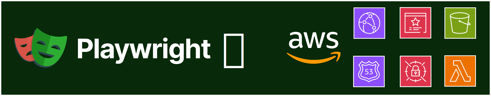

<h1 align="center">
  
</h1>

# Playwright Reporting in AWS

This repository showcases how Playwright's HTML report can be fully integrated into AWS such that the reports can be shared and viewed via HTTPS, including the traces embedded into them.

## Repository Structure

The repository contains three main directories:

- a directory for the Playwright tests (`playwright`)
- a directory for the AWS infrastructure (`terraform`)
  - a subdirectory for the main infrastructure (CloudFront, S3 buckets, certificates, ...)
  - a subdirectory for the AWS Lambda performing basic HTTP authentication
- the `.github` directory containing the GitHub Action for uploading reports to AWS

## Setup

To fully set everything up, you need to have the following tools installed:

- [Node.js](https://nodejs.org/en/download)
- [Terraform](https://developer.hashicorp.com/terraform/install)

### Playwright

The `playwright` folder contains a few very basic Playwright tests.
They can be setup and executed by running the following commands:

```sh
cd playwright
npm install
npx playwright install --with-deps
npx playwright test
```

The HTML report should open automatically after each test run.

### AWS

> [!IMPORTANT]
> Before you can begin provisioning the infrastructure, you need to have an ACM certificate for a wildcard domain.
> For example, if your domain is called `mydomain.com`, your certificate must contain the wildcard subdomain `*.mydomain.com`.

The general steps to provision the entire infrastructure are as follows:

#### 1. Build AWS Lambda

The CloudFront distribution requires access to an existing Lambda function.
Therefore, this Lambda function must be built and deployed first.

The function is written in Typescript.
To build it, run:

```sh
cd terraform/lambda
npm install
npm run build
```

When prompted for an AWS Secret ARN, simply press enter if you're deploying the function for the first time.

This will create the minified authentication script inside a `dist` folder, which Terraform can subsequently zip and transform into an actual Lambda.

#### 2. Deploy AWS Lambda

To deploy the Lambda function, run:

```sh
cd terraform/lambda
terraform apply
```

This will create the Lambda function as well as a secret in the AWS Secret Manager.

> [!IMPORTANT]
> If the function is deployed for the first time, you will need to rebuild and redeploy it using the newly created secret ARN.
> The required ARN will be printed to the console as soon as Terraform is done.
> If you do not rebuild and redeploy the Lambda, the basic authentication function will not work!

#### 3. Deploy AWS CloudFront

Once the Lambda is deployed and properly configured with a secret ARN, the CloudFront distribution can be deployed. To do so, run:

```sh
cd terraform/cloudfront
terraform apply
```

Terraform is going to prompt you for:

- the root domain name of your ACM certificate, e.g. `mydomain.com`
- the subdomain name, e.g. `playwright-reports`
- the ARN of the HTTP basic authentication Lambda, which can be obtained as output from step 2

Deployment can take up to 15-20 minutes, but once it's done you can access your distribution using `https://<subdomain>.<domain>`.
You are then free to upload data to the distribution's bucket, for example Playwright HTML reports.

### GitHub Action

The GitHub action requires three secrets to be setup in the repository:

- `AWS_CLIENT_ID`: the AWS client ID
- `AWS_CLIENT_SECRET`: the AWS client secret
- `AWS_S3_BUCKET_NAME`: the bucket name of the CloudFront distribution
